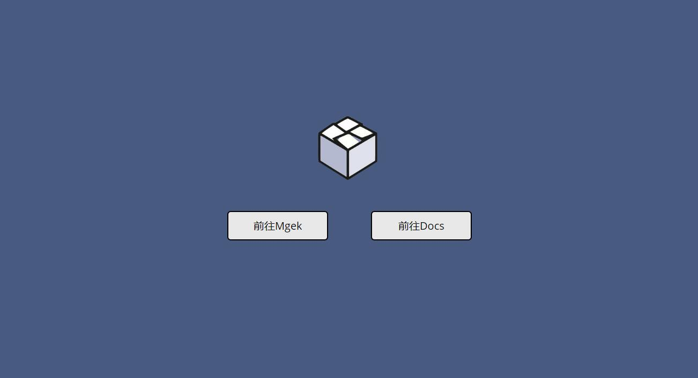

# Mgek
Mgek项目汇总索引

### 什么是Mgek？

Mgek是我的个人开源项目集合名称，意为**Magic work**

生活中总有许多一闪而过的灵感，我想把这些东西记录下来，用代码的方式实现，赋予灵感以魔(mo)法的力量

### Mgek项目一览

[Mgekserv](https://github.com/Landers1037/simple-email-sms)一个基于python的自动邮件短信通知服务

[Mgekpi](https://github.com/Landers1037/Mgekpi)整合了aria2，you-get，wget的下载工具(因为部分bug已关闭)

[Mgekdown](https://github.com/Landers1037/mgekflask)配合hexo模板使用的markdown转html工具

[Mgekssr](https://github.com/Landers1037/mgekflask)一个可视化ssr定时爬虫docker容器

[Marked-Flask](https://github.com/Landers1037/marked-flask)一个使用`marked.js`实时渲染markdown文件的flask框架

[MgekImgHost](https://github.com/Landers1037/mgekimghost)一个轻量本地图床

### 正在构建

Font-Cutter网络字体裁剪压缩工具

Proxy-Bar代理ip可视化爬虫管理平台

### 开源许可

Mgek项目使用**MIT**开源许可和**GPL**开源许可，你可以自由地下载源码，在基础上进行自己的修改并发布，一起改进Mgek

### 关于我

我的GitHub[地址](https://github.com/Landers1037)

[我的个人主页](http://lrenj.top)

[Mgek项目主页](http://mgek.cc)

[我的技术博客](http://blog.lrenj.top)

困难永远不是阻挡前进的屏障